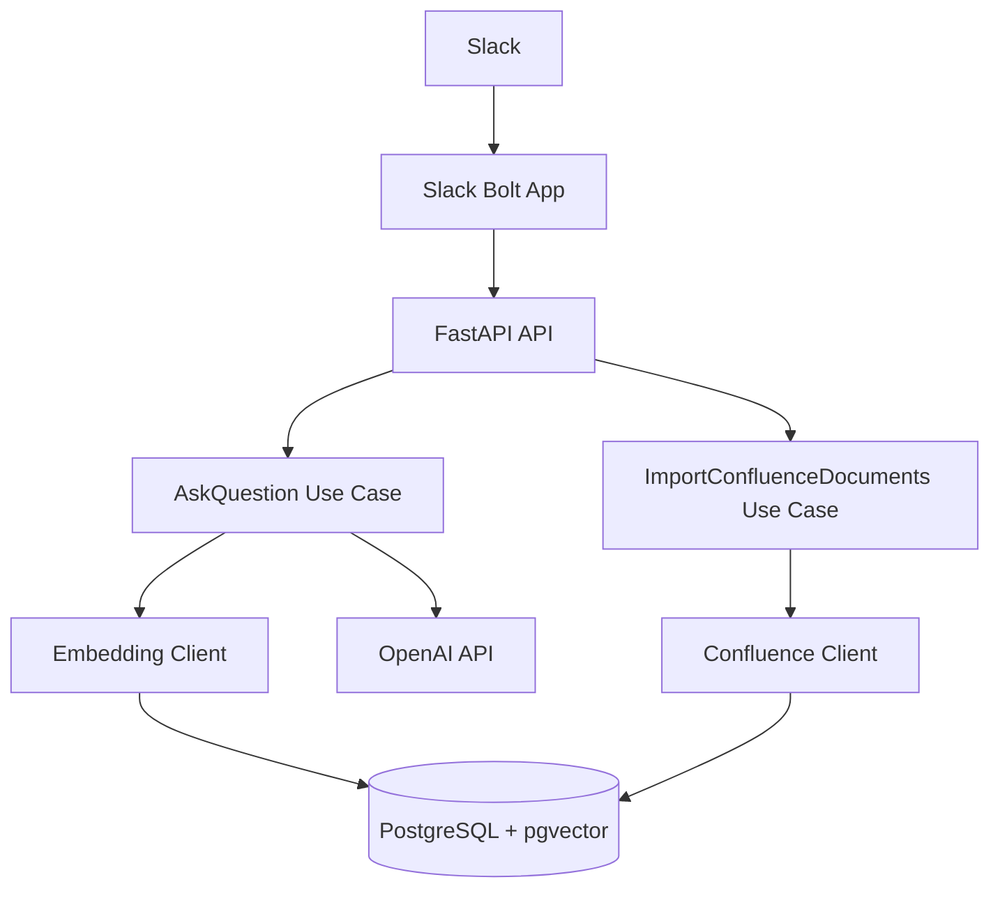
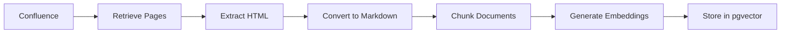
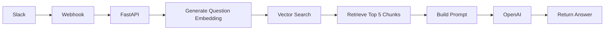

# Architecture

## Overview

Cortex is built following a **Hexagonal Architecture (Ports and Adapters)**.

The primary objective is to isolate business logic from infrastructure concerns, allowing the application to evolve independently of external technologies.

The Presentation layer is organized using the **Vertical Slice** pattern, grouping API endpoints and request/response models by feature.

---

# Architectural Principles

The architecture follows these principles:

- Business logic is independent of frameworks.
- External systems communicate through adapters.
- Infrastructure depends on the application, never the opposite.
- Dependencies point inward.
- Every layer has a single responsibility.

---

# Component Overview



---

# Document Ingestion Flow



---

# Question Answering Flow



---

# Layers

## Presentation

Responsible for exposing the application to external clients.

Examples:

- REST API
- Slack Webhooks
- Swagger

Presentation does not contain business rules.

---

## Application

Contains the application's use cases.

Responsibilities:

- Coordinate business operations.
- Invoke repositories.
- Invoke external ports.
- Manage application workflows.

Examples:

- AskQuestionUseCase
- ImportConfluenceDocumentsUseCase

---

## Domain

Contains the business model.

Responsibilities:

- Entities
- Value Objects
- Domain Rules
- Repository Contracts

The domain layer must not depend on external frameworks or infrastructure.

---

## Infrastructure

Contains all technical implementations.

Examples:

- PostgreSQL
- pgvector
- OpenAI
- Confluence
- Slack
- SQLAlchemy

Infrastructure implements the ports defined by the application.

---

# Dependency Rule

Dependencies always point toward the center of the architecture.

```text
Presentation
      ↓
Application
      ↓
Domain

Infrastructure
      ↑
implements Application Ports
```

The Domain layer must never depend on:

- FastAPI
- SQLAlchemy
- Slack SDK
- OpenAI SDK
- PostgreSQL
- HTTP Clients

---

# Future Evolution

The current architecture is intentionally designed to support future extensions, including:

- Multiple knowledge sources
- Multiple LLM providers
- Authentication and authorization
- Conversation memory
- Background processing
- Observability
- Streaming responses

These capabilities are intentionally out of scope for the MVP.

---

# Architecture Decision References

- ADR-0001 — Adopt Hexagonal Architecture with Vertical Slice Presentation Layer

---

# Guiding Principle

Cortex prioritizes maintainability, modularity, and incremental evolution over premature optimization.

The architecture should make future changes easier, not more complicated.