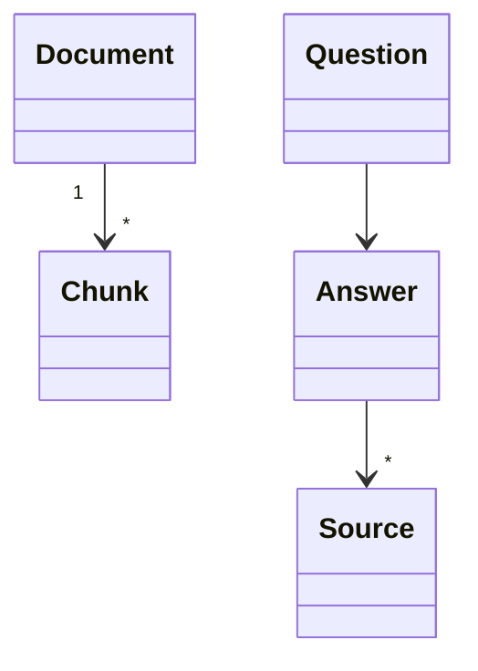
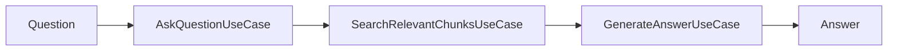

# Domain Model

## Overview

The Cortex domain represents the concepts involved in importing, indexing, retrieving, and presenting organizational knowledge through natural language interactions.

The domain model intentionally focuses on business concepts rather than implementation details.

Technologies such as FastAPI, PostgreSQL, pgvector, OpenAI, Slack, and Confluence are infrastructure concerns and are intentionally excluded from this document.

---

# Design Principles

The domain model follows these principles:

- The domain is independent of frameworks and infrastructure.
- Business concepts should be explicit and easy to understand.
- The model should evolve incrementally alongside the product.
- Infrastructure concerns must not leak into the domain.
- New concepts should only be introduced when they represent real business needs.

---

# Core Domain

## Entities

Entities have identity and lifecycle within the system.

| Entity | Responsibility | Attributes |
|---------|----------------|------------|
| `Document` | Represents a knowledge document imported into Cortex. | `id`, `title`, `url`, `last_modified` |
| `Chunk` | Represents a searchable fragment of a document. | `id`, `document_id`, `content`, `embedding` |

---

## Value Objects

Value Objects describe information without identity.

| Value Object | Responsibility | Attributes |
|--------------|----------------|------------|
| `Question` | Represents a user's question. | `query` |
| `Answer` | Represents the generated answer returned to the user. | `text`, `sources` |
| `Source` | Represents a document reference supporting an answer. | `title`, `url` |

---

# Relationships



A single document is divided into multiple chunks.

An answer may reference multiple documentation sources.

---

# AI Domain

The following concepts are fundamental to Cortex's Retrieval-Augmented Generation (RAG) architecture.

These are conceptual elements of the domain and should not be confused with infrastructure implementations.

| Concept | Description |
|----------|-------------|
| Embedding | A vector representation of textual content used for semantic search. |
| Context | The collection of retrieved chunks provided to the LLM. |
| Retrieval | The process of locating the most relevant chunks for a question. |
| Prompt | The structured input sent to the LLM. |
| Citation | References included in an answer to indicate supporting documentation. |

These concepts may eventually become explicit domain objects if business requirements justify them.

---

# Use Cases

The application layer coordinates the domain through the following use cases.

| Use Case | Category | Responsibility | Input | Output |
|-----------|----------|----------------|-------|--------|
| `ImportConfluenceDocumentsUseCase` | Command | Imports documentation from Knowledge repository and stores searchable content. | Source configuration | Indexed documents and chunks |
| `SearchRelevantChunksUseCase` | Query | Retrieves the most relevant chunks for a given question. | `Question` | Up to five `Chunk`s |
| `GenerateAnswerUseCase` | Query | Generates an answer using the retrieved context. | `Question`, retrieved chunks | `Answer` |
| `AskQuestionUseCase` | Facade | Orchestrates the complete question-answer workflow. | `Question` | `Answer` |

---

# Use Case Relationships



`AskQuestionUseCase` orchestrates the interaction between the retrieval and answer generation processes.

It must not depend on infrastructure concerns such as Slack, FastAPI, OpenAI SDK, SQLAlchemy, or Confluence APIs.

---

# Aggregate Boundaries

At the current stage of the project, Cortex maintains a deliberately simple domain model.

The aggregate boundaries are:

```text
Document
└── Chunk*
```

A `Chunk` cannot exist without a `Document`.

No additional aggregates are required for the MVP.

---

# Domain Invariants

The following rules must always hold true:

- Every `Chunk` belongs to exactly one `Document`.
- A `Document` may contain one or many `Chunk`s.
- An `Answer` should always be supported by one or more `Source`s whenever evidence exists.
- The system should never fabricate documentation sources.
- Business entities must remain independent from infrastructure frameworks.

---

# Out of Scope

The following concepts are intentionally excluded from the MVP domain model:

- Users
- Authentication
- Authorization
- Conversations
- Chat history
- Feedback
- Ratings
- Knowledge source abstraction
- Multi-tenancy
- Permissions synchronization

These concepts may be introduced as the product evolves.

---

# Future Evolution

The domain model is expected to grow incrementally.

Potential future entities include:

- `KnowledgeSource`
- `Conversation`
- `Message`
- `Citation`
- `Feedback`
- `User`
- `Workspace`

These concepts will only be introduced when supported by concrete business requirements.

---

# Guiding Principle

The domain model should describe the business, not the technology.

Whenever a new concept is introduced, ask:

> Does this represent a business concept, or is it merely an implementation detail?

Only business concepts belong in the domain model.